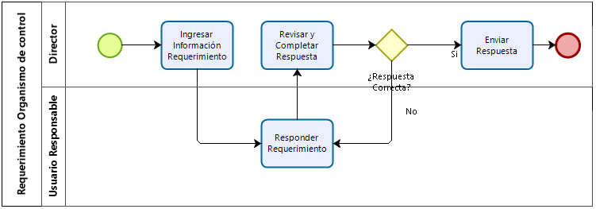

# Ejemplo 1

## Diagrama que se busca programar

{width=70%}\

## Código fuente realizado

```
t_pool = "Requerimiento Organismo de control"
pool(t_pool):
	
	t_director = "Director"
	t_user = "Usuario Responsable"
	t_submit_info = "Ingresar Información Requerimiento"
	t_answer = "Responder Requerimiento"
	t_check = "Revisar y Completar Respuesta"
	t_correct = "¿Respuesta correcta?"
	t_send = "Enviar Respuesta"

	line user(t_user):
		task answer
	@ line director(t_director)

	start -> task(t_submit_info) -> task answer(t_answer)-> task(t_check)\
	-> gate(t_correct, exclusion,):
		->("Sí") task(t_send) -> event_end
		->("No", tk.answer) 
```
