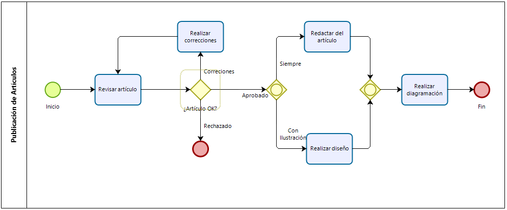

# Ejemplo 2

## Diagrama que se busca programar

{ width=70% }\

## Código fuente realizado

```
pool("Publicsción de Artículos"):
	t_corrections = "Realizar correciones"
	t_layout = "Realizar diagramación"
	t_write = "Redactar del  artículo"
	t_check = "Revisar artículo"
	t_design = "Realizar diseño"
	t_ill = "Con Ilustración"
	t_ok = "¿Article OK?"
	t_cor = "Correciónes"
	t_apr = "Aprobado"
	t_rej = "Rechazado"
	t_alw = "Siempre"

	start -> task check(t_check) -> gate(t_ok, exclusive,):
		->(t_cor) task(t_corrections) ->(, check)
		->(t_apr) gate(, inclusive, inclusive):
				->(t_alw) -> task(t_wite)
				->(t_ill) -> task(t_design)
			-> task(t_layout) -> end
		->(t_rej) end
```
