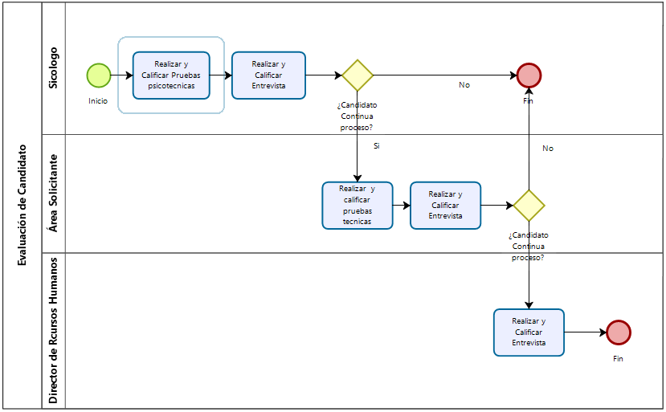

# Ejemplo 3

## Diagrama que se busca programar

{ width=50% }\

## Código fuente realizado

```
t_pool = "Evalueción de Candidato"

pool(t_pool):
	t_l1 = "Director de Recursos humanos"
	t_l2 = "Área Solicitante"
	t_l3 = "Psicólogo"
	
	t_psy = "Realizar y Caificar Pruebas psicotécnicas"
	t_tec = "Realizar y calificar pruebas técnicas"
	t_continue = "¿Candidato continúa el proceso?"
	t_inter = "Realizar y Caificar Entrevista"
	
	start -> task(t_psy) -> task(t_inter) -> \
		gate(t_continue, exclusive):
			->("No") end end_interview
			->("Sí") task(t_tec) -> task(t_inter) ->\
				gate(t_continue, exclusive,):
					->("No", ev.end_interview)
					->("Sí") task(t_inter) -> end
```
