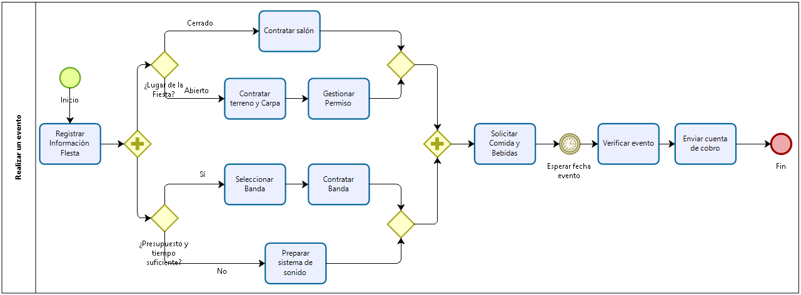

# Ejemplo 4

## Diagrama que se busca programar

{ width=80% }\

## Código fuente realizado

```
pool("SOLICITUD"):
    t_1 = "Solicitar viaje"
    t_2 = "Solicitud apravoda"

    start task id_1(t_1,,) task id_2(t_2,,) end
```
